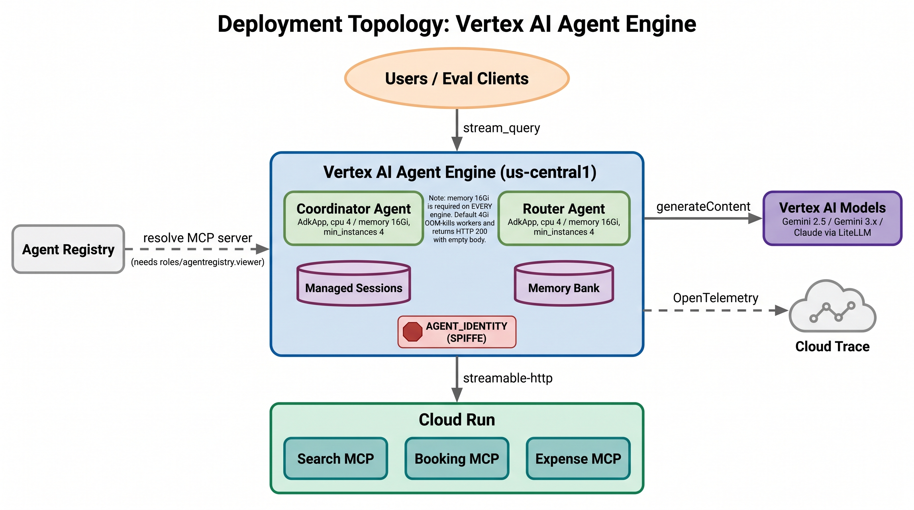
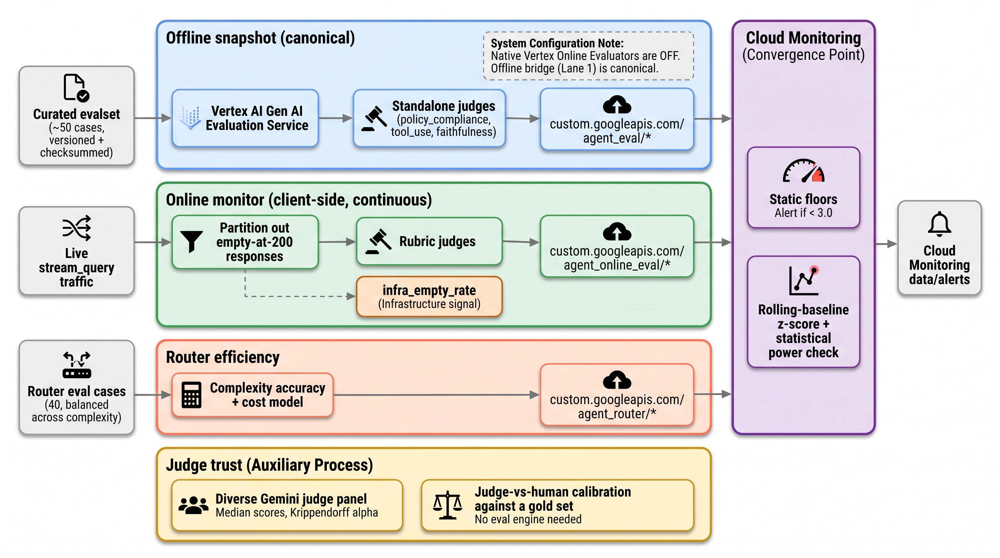
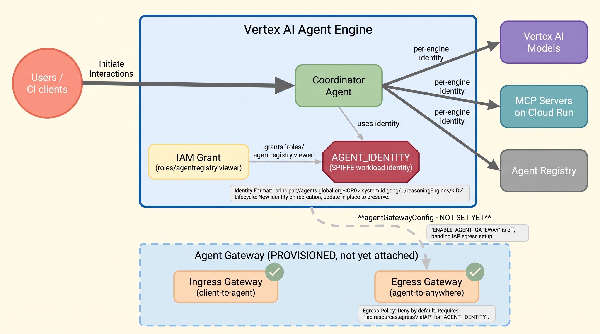
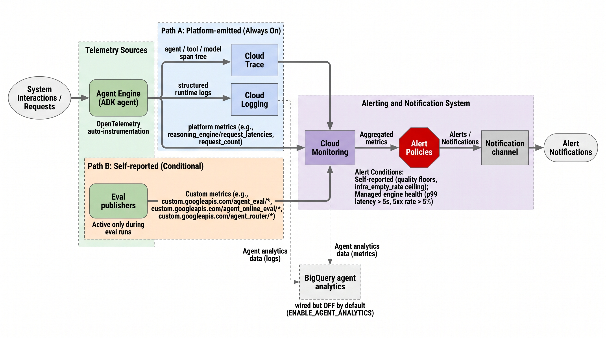
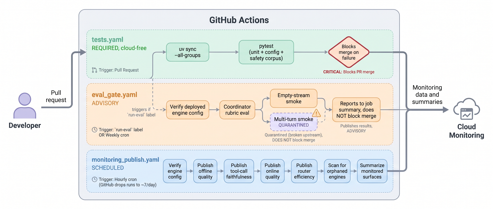
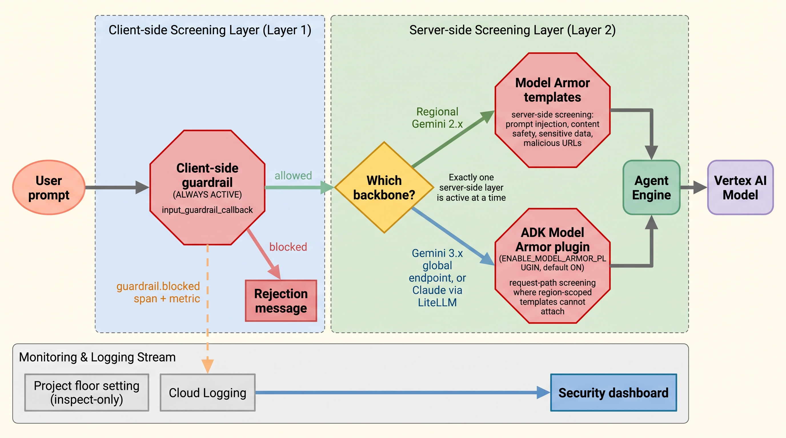

# GEAP Workshop: Enterprise Agent Platform Tour

A hands-on workshop demonstrating the full Gemini Enterprise Agent Platform (GEAP) — from building ADK agents with MCP tools through deployment, governance, evaluation, and optimization.

## What's Inside

| Area | Description |
|------|-------------|
| **ADK Agents** | 7 agents: coordinator, router, + 5 standalone model-tier agents (lite, flash, pro, sonnet, opus) |
| **MCP Servers** | Three FastMCP tool servers on Cloud Run with OTel instrumentation (search, booking, expense) |
| **Multi-Model Router** | Complexity-based routing across 5 models spanning Google Gemini and Anthropic Claude |
| **Deployment** | Agent Runtime deployment with identity, gateway, and OTel tracing |
| **Evaluation** | Batch eval (6 metrics), simulated multi-turn eval, online evaluators, cross-model experiments |
| **Optimization** | GEPA (Gemini Evolutionary Prompt Algorithm) for all 5 model-tier agents |
| **Model Armor** | Model Armor templates for input/output screening + client-side guardrails |
| **Governance** | Agent identity (SPIFFE), agent gateway (ingress + egress), agent registry, Semantic Governance Policies (SGP) |
| **Topology** | App Hub registration for agent-to-MCP topology visualization |
| **CI/CD** | GitHub Actions workflow running simulated evals on PRs |

## Project Structure

```
src/
├── agents/                    # Standalone deployable agents
│   ├── coordinator_agent.py   # Domain router (travel vs expense)
│   ├── travel_agent.py        # Flight/hotel search + booking
│   ├── expense_agent.py       # Expense submission + policy checks
│   ├── lite_agent.py          # Tier 1: gemini-3.1-flash-lite ($0.30/M)
│   ├── flash_agent.py         # Tier 2: gemini-3.5-flash ($0.60/M)
│   ├── pro_agent.py           # Tier 3: gemini-3.1-pro-preview ($10/M)
│   ├── sonnet_agent.py        # Tier 4: claude-sonnet-4-6 ($15/M)
│   └── opus_agent.py          # Tier 5: claude-opus-4-6 ($75/M)
├── router/                    # Multi-model complexity router
│   ├── agents.py              # Router + AgentTool-wrapped sub-agents
│   ├── complexity.py          # Prompt complexity classifier
│   └── *_agent_opt/           # GEPA optimization wrappers
├── mcp_servers/               # MCP tool servers (Cloud Run)
│   ├── search/                # Flight + hotel search
│   ├── booking/               # Flight + hotel booking
│   ├── expense/               # Expense management
│   └── otel_setup.py          # Shared OTel instrumentation
├── eval/                      # Evaluation pipelines
│   ├── multi_agent_batch_eval.py    # Batch eval (6 metrics)
│   ├── simulated_eval.py           # Multi-turn simulated eval
│   ├── cross_model_experiment.py    # All models × all tiers
│   ├── setup_online_evaluators.py   # Online evaluator management
│   └── agent_eval_configs.py        # Eval cases + metrics
├── deploy/                    # Deployment scripts
│   └── deploy_agents.py       # Deploy/update agents with auto .env write
├── optimize/                  # GEPA optimization configs
│   └── run_optimize.py        # Python-native GEPA runner
├── traffic/                   # Traffic generation
│   └── generate_traffic.py    # Burst + steady-state traffic
└── config.py                  # Shared config, resolve_model(), disable_pyopenssl()

scripts/                       # Shell scripts for infrastructure
├── setup_apphub.sh            # App Hub topology registration
├── setup_agent_gateway.sh     # Agent Gateway (ingress + egress)
├── setup_governance_policies.sh  # IAM + SGP governance
└── deploy_all.sh              # Full end-to-end deployment

docs/                          # Analysis reports
├── gepa_optimization_analysis.md  # GEPA before/after analysis
├── cross_model_experiment.md      # Cross-model complexity experiment
├── prompts/                       # Before/after prompt comparisons
└── charts/                        # Matplotlib + PaperBanana visualizations
```

## Documentation

| Document | Description |
|----------|-------------|
| [Workshop Guide](docs/workshop_guide.md) | Full 4-session hands-on walkthrough |
| [Component FAQ](docs/faq.md) | What each component does and why it matters |
| [Evaluation Guide](docs/eval_operations.md) | Evaluation pipeline operations |
| [GEPA Analysis](docs/gepa_optimization_analysis.md) | Prompt optimization before/after results |
| [Cross-Model Experiment](docs/cross_model_experiment.md) | All models × all complexity tiers |
| [Cost Comparison](docs/multi_model_cost_comparison.md) | Multi-model routing cost analysis |
| [Slides](docs/slides.pptx) | Workshop deck (34 slides) |

## Quick Start

```bash
# Install dependencies
uv sync

# Copy and configure environment
cp .env.example .env
# Edit .env with your GCP project details

# Run tests
uv run pytest tests/

# Deploy everything in one command
bash scripts/deploy_all.sh

# Setup governance policies (IAM only)
bash scripts/setup_governance_policies.sh

# Setup governance policies with SGP (IAM + Semantic Governance Policies)
bash scripts/setup_governance_policies.sh --sgp
```

## Screenshots

All screenshots are captured from real deployed GCP resources:

| Screenshot | Feature |
|-----------|---------|
|  | Agent Gateway ingress detail (geap-workshop-gateway) |
|  | MCP server on Cloud Run |
|  | Multi-agent deployment |
|  | Agent Gateway (ingress + egress) |
|  | Agent traces — session view with model calls and token usage |
|  | Trace spans — individual trace view |
|  | Input/output screening |
|  | Three-tier eval pipeline |
|  | MCP servers in Agent Registry |
|  | Log Router sinks to BigQuery |
|  | IAM Allow governance policies |
|  | Semantic Governance Policies (SGP) |

## Workshop Guide

See [docs/workshop_guide.md](docs/workshop_guide.md) for the full workshop organized into 4 sessions. For component-level details, see the [Component FAQ](docs/faq.md).

| Session | Topic | Duration |
|---------|-------|----------|
| **Session 1** | AI Gateway / MCP Gateway | ~90 min |
| **Session 2** | AI Gateway / MCP Gateway (continued) | ~75 min |
| **Session 3** | Agent Registry | ~15 min |
| **Session 4** | Model Security / Model Armor | ~15 min |

## Architecture


*Agent Platform architecture showing the full request flow: User → Frontend → Agent Gateway → Agent Identity (Agent Platform Runtime) → Agent Gateway → downstream Agents, Tools, Models, and APIs. Governed by Agent Registry, AI Security, and Access Authorization with full AI Observability.*

### Agent Identity Model


The platform supports three identity types for secure agent operations:

| Identity | Purpose | Issuing System |
|----------|---------|----------------|
| **ID-1: User Identity** | User accessing the agent or SaaS application | Human IdP (Entra, Cloud Identity, Auth0) |
| **ID-2: Agent Identity** | Agent accessing resources under its own authority | GCP — created when agent is deployed |
| **ID-3: Delegated Identity** | Agent accessing resources on behalf of the user | OAuth server (1P or 3P) via OAuth dance |

In our workshop, agents use SPIFFE-based workload identity (ID-2) with attestation policies, and the Agent Gateway enforces identity at the network boundary.

### Paper Banana Architecture Diagrams

| Diagram | Description |
|---------|-------------|
|  | Coordinator agent routing to travel and expense sub-agents with MCP tool servers |
|  | Cloud Run MCP servers + Agent Runtime deployment topology |
|  | Three-tier evaluation: one-time, continuous, and CI/CD simulated |
|  | SPIFFE identity, attestation policies, and Agent Gateway flow |
|  | OTel traces → Cloud Trace → BigQuery pipeline |
|  | GitHub Actions simulated eval gate on pull requests |
|  | Model Armor input/output screening with guardrail callbacks |

## Project Structure

```
src/
├── agents/          # ADK agent definitions
├── armor/           # Model Armor config + guardrail callbacks
├── mcp_servers/     # FastMCP tool servers (search, booking, expense)
├── deploy/          # Deployment scripts for Cloud Run + Agent Runtime
├── eval/            # Evaluation pipeline (one-time, online, simulated)
├── optimize/        # Agent optimization (GEPA algorithm)
├── router/          # Multi-model complexity router
└── traffic/         # Traffic generation for OTel traces
scripts/             # Shell scripts for identity, gateway, registry setup
diagrams/            # Paper Banana architectural diagrams
docs/                # Workshop guide
tests/               # Unit and integration tests
```
