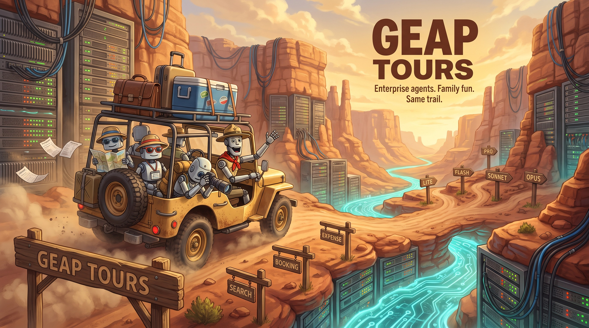
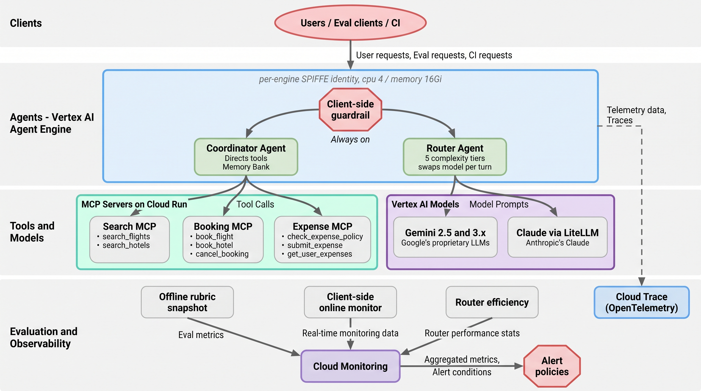

# GEAP Workshop: Enterprise Agent Platform Tour



A hands-on workshop demonstrating the full Gemini Enterprise Agent Platform (GEAP) — from building ADK agents with MCP tools through deployment, governance, evaluation, and optimization.

## What's Inside

| Area | Description |
|------|-------------|
| **ADK Agents** | 7 `deploy_agents` targets — coordinator (direct MCP tools + Memory Bank), multi-model router, and 5 model-tier agents (lite, flash, pro, sonnet, opus) — plus travel and expense agents with their own evalsets |
| **MCP Servers** | Three FastMCP tool servers on Cloud Run with OTel instrumentation (search, booking, expense), stateless HTTP, bounded list payloads |
| **Multi-Model Router** | 5-tier complexity router across Gemini and Claude — one direct-tools agent that swaps **model + prompt** per tier |
| **Memory Bank** | Cross-session recall via `VertexAiMemoryBankService`, an optional per-invocation preload cache, and seed/verify CLIs |
| **Deployment** | Agent Runtime deployment with SPIFFE identity, gateway, keep-warm `--min-instances`, and OTel tracing |
| **Evaluation** | Offline batch (6 metrics), a continuous **online quality monitor**, tool-call **faithfulness**, a diverse judge panel, and judge-vs-human calibration. Multi-turn `simulated_eval` is **quarantined** — it returns zero metrics on google-cloud-aiplatform 2.1.0 for reasons inside the SDK's own parsing; it still runs in CI so we find out if upstream fixes it |
| **Monitoring** | Three published metric surfaces (`agent_eval/*`, `agent_online_eval/*`, `agent_router/*`) plus managed engine-health alerts and rolling-baseline anomaly detection |
| **Experiments** | DOE framework (fractional-factorial → one Vertex PipelineJob per design point) and a Gemini-vs-Claude coordinator bake-off |
| **Optimization** | GEPA (Gemini Evolutionary Prompt Algorithm) with sampler configs for the coordinator, router, travel, expense, and all 5 model-tier agents |
| **Model Armor** | Two layers — ADK's first-party Model Armor plugin (default **on**) and region-scoped templates, plus a client-side guardrail with block telemetry that is the guaranteed layer on every backbone |
| **Skill Registry** | Three instruction-only travel/expense skills in git, an idempotent publish CLI, and an opt-in `SkillToolset` (default **off**) — publishing is verified live; runtime discovery is blocked upstream and [documented as such](docs/notes/skill-registry.md) |
| **Governance** | Agent identity (SPIFFE), agent gateway (ingress + egress), Agent Registry, Semantic Governance Policies (SGP) |
| **A2A** | Agent-to-agent card publication + discovery for the coordinator (preview-optional, degrades gracefully) |
| **Topology** | App Hub registration for agent-to-MCP topology visualization |
| **CI/CD** | Always-on unit tests, an advisory eval gate (label-gated **and** weekly, because a label-only gate went 15 runs without executing once), and the eval DAG as a Vertex Managed Pipeline |

## Documentation

| Document | Description |
|----------|-------------|
| [Workshop Guide](docs/workshop_guide.md) | Full 4-session hands-on walkthrough |
| [Component FAQ](docs/faq.md) | What each component does and why it matters |
| [Evaluation Guide](docs/eval_operations.md) | Evaluation pipeline operations |
| [Engineering Notes](docs/notes/README.md) | 44 root-cause / design notes (streaming, quota, latency, memory scope, eval bridges) |
| [Demo Notebooks](notebooks/demo/README.md) | SDK-first platform + evaluation tours; every billable cell is opt-in |
| [GEPA Analysis](docs/gepa_optimization_analysis.md) | Prompt optimization before/after results — **historical (2026-05)**, engine ids dead |
| [Cross-Model Experiment](docs/cross_model_experiment.md) | All models × all complexity tiers — **historical (2026-08-05)**; its "use Lite for medium" conclusion was later measured and rejected |
| [Cost Comparison](docs/multi_model_cost_comparison.md) | Multi-model routing cost analysis — **historical**; three-tier framing and model ids superseded |
| [Code Standards](CODE_STANDARDS.md) | Git, Python tooling, and testing conventions |
| [Slides](docs/slides.pptx) | Workshop deck (34 slides) |

## Quick Start

```bash
# Install dependencies — --all-groups matters. tests/conftest.py drops the DOE and
# pipeline modules when pyDOE3/kfp are absent, so a bare `uv sync` gives you a
# green run that is quietly ~40 tests short, with no skips and no warning.
uv sync --all-groups

# Copy and configure environment
cp .env.example .env
# Edit .env with your GCP project details

# Run tests (offline — no live GCP or MCP connections needed). Expect 1793.
# Use --no-sync: a bare `uv run` re-syncs to the default groups and re-creates
# the same silent shortfall.
uv run --no-sync pytest tests/

# Deploy everything in one command
bash scripts/deploy_all.sh

# Setup governance policies (IAM only)
bash scripts/setup_governance_policies.sh

# Setup governance policies with SGP (IAM + Semantic Governance Policies)
bash scripts/setup_governance_policies.sh --sgp
```

Common follow-ups (full command reference in [CLAUDE.md](CLAUDE.md)):

```bash
# Deploy or update a single agent (auto-writes the engine id to .env)
uv run python -m src.deploy.deploy_agents coordinator --update

# Prove the deployed agent's MCP toolsets actually resolve their tools
uv run python -m src.eval.verify_mcp_tools --json

# A merged fix is not a deployed fix — diff a LIVE engine against the baseline
# (read-only; exits non-zero only on critical drift, e.g. a 4Gi container)
uv run python -m src.deploy.verify_engine_config

# Score sampled live traffic and publish the online quality surface
uv run python -m src.eval.online_monitor --agent-id <ENGINE_ID>

# Read all three monitored surfaces back
uv run python -m src.eval.verify_monitors --format json
```

## Screenshots

> **Provenance (audited 2026-08-22):** these are console captures from a
> **reference project (`wortz-project`)**, not from this repo's deployment in
> `hybrid-vertex`. They illustrate what each Agent Platform console surface looks
> like; they are **not** evidence of this system's state. Several show a different
> agent ("Demo Finance Agent ADK v2") or an empty list. Where a caption below says
> what the capture actually contains rather than what we wish it showed, that is
> deliberate. Re-capturing against `hybrid-vertex` is the real fix.

| Screenshot | Feature |
|-----------|---------|
|  | Agent Gateway ingress detail — **reference project only**; the `agentGateways` API 404s in `hybrid-vertex` (private preview, early access not granted) |
|  | MCP server on Cloud Run |
|  | The Agent Runtime deployments console — the list is **empty** in this capture, with an "Enable APIs" banner |
|  | Gateways list showing ingress + egress — note the banner: Agent Gateway is in **Private Preview** and needs early access |
|  | Trace session view — captured against a different agent ("Demo Finance Agent ADK v2", 0 tool calls), so it shows the *surface*, not our trajectories |
|  | Trace spans — individual trace view |
|  | Input/output screening |
|  | Three-tier eval pipeline |
|  | The Agent Registry MCP Servers tab — lists Google's built-in servers (`agentregistry.googleapis.com`), not our search/booking/expense servers |
|  | Log Router sinks to BigQuery |
|  | IAM Allow governance policies |
|  | Semantic Governance Policies (SGP) |

## Workshop Guide

See [docs/workshop_guide.md](docs/workshop_guide.md) for the full workshop organized into 4 sessions. For component-level details, see the [Component FAQ](docs/faq.md).

| Session | Topic | Duration |
|---------|-------|----------|
| **Session 1** | AI Gateway / MCP Gateway | ~90 min |
| **Session 2** | AI Gateway / MCP Gateway (continued) | ~75 min |
| **Session 3** | Agent Registry | ~15 min |
| **Session 4** | Model Security / Model Armor | ~15 min |

## Architecture


*Agent Platform architecture showing the full request flow: User → Frontend → Agent Gateway → Agent Identity (Agent Platform Runtime) → Agent Gateway → downstream Agents, Tools, Models, and APIs. Governed by Agent Registry, AI Security, and Access Authorization with full AI Observability.*

### Agent Identity Model


The platform supports three identity types for secure agent operations:

| Identity | Purpose | Issuing System |
|----------|---------|----------------|
| **ID-1: User Identity** | User accessing the agent or SaaS application | Human IdP (Entra, Cloud Identity, Auth0) |
| **ID-2: Agent Identity** | Agent accessing resources under its own authority | GCP — created when agent is deployed |
| **ID-3: Delegated Identity** | Agent accessing resources on behalf of the user | OAuth server (1P or 3P) via OAuth dance |

In our workshop, agents use SPIFFE-based workload identity (ID-2) with attestation policies, and the Agent Gateway enforces identity at the network boundary.

### Two agent topologies

Both deployables hold their MCP toolsets **directly** on the root agent. That is not a style choice: on the managed Agent Runtime only the *root* agent's own output streams back, so delegating a turn (`transfer_to_agent`, or a nested `AgentTool` MCP call) never streamed the specialist's answer. Both agents were rearchitected around the pattern that does stream.

| | **Coordinator** (`src/agents/coordinator_agent.py`) | **Multi-model router** (`src/router/agents.py`) |
|---|---|---|
| Role | Task executor | Economic optimizer |
| Tools | All three MCP toolsets + a memory-preload tool | Same — all three MCP toolsets + a memory-preload tool |
| Per-request variation | None — one model, one prompt | Swaps **model and prompt** per complexity tier |
| Routing | Delegates to nobody | `before_agent_callback` scores 0–1, picks 1 of 5 tiers |
| Scored on | Quality rubrics (`agent_eval/*`, 1–5) | Efficiency (`agent_router/*`, native units) |

`travel_agent` and `expense_agent` are no longer wired under the coordinator, but they remain **independently evaluated** agents with their own evalsets (`multi_agent_batch_eval --agents travel_agent`) — separate deployables, not duplication.

Router tiers by complexity score (defaults): `<0.25` lite (`gemini-3.1-flash-lite`), `0.25–0.60` flash (`gemini-3.5-flash`), `0.60–0.925` sonnet (`claude-sonnet-4-6`), `0.925–0.95` pro (`gemini-3.1-pro-preview`), `≥0.95` opus (`claude-opus-4-6`). All four cut-points are env-overridable (`COMPLEXITY_LOW` / `MEDIUM_SPLIT` / `COMPLEXITY_HIGH` / `HIGH_SPLIT`) and both outer ones are guarded as **critical** by the deployed-engine baseline, because they bake in at deploy time and drift silently otherwise.

Two of those cut-points were deliberately moved **off** their DOE-tuned values by paired side-by-side tests, because a dataset *mean* had diluted a real regression to noise. At the DOE's 0.44 low cut every 0.40-scoring "medium" prompt went to lite, where flash beat it **18–1** (p=0.0001) — so `COMPLEXITY_LOW` dropped to 0.25. `COMPLEXITY_HIGH` moved the other way, 0.80 → 0.925, after sonnet beat pro **17–1**. Net effect: `routing_accuracy_pct` 50% → **82.5%** for 0.3pp of cost savings, so the two monitored series were never actually in conflict. One consequence worth stating plainly rather than glossing: **the pro tier now receives nothing on this workload**, joining opus — the 5-tier router serves three tiers here. See [docs/notes/router-boundary-experiment.md](docs/notes/router-boundary-experiment.md).

### Paper Banana Architecture Diagrams

Specs live in `diagrams/inputs/`; regenerate with `./scripts/generate_diagrams.sh`.

All eight regenerated 2026-09-10 from corrected specs, after four of them
(`01_multi_agent_topology`, `05_observability_stack`, `06_ci_cd_flow`,
`07_agent_armor`) were found to disagree with the system they describe.
`07_agent_armor` was the worst: it claimed a Gemini-3 or Claude backbone ran with
the client-side guardrail as its *only* layer, which stopped being true when ADK's
Model Armor plugin became the default in #111.

Regeneration needs `GOOGLE_API_KEY` (or `OPENAI_API_KEY`), read from `.env` or the
environment. Note that a missing or unusable key fails **every item individually
while the batch still exits 0** — read the per-item table, not the exit code.

| Diagram | Description |
|---------|-------------|
|  | Single-slide overview: clients → guardrail → the two agents → MCP tools and models → the three eval surfaces |
|  | Two independent **direct-tools** topologies — the coordinator and the 5-tier router each hold all three MCP toolsets; neither delegates to sub-agents |
|  | Agent Engine deployment: per-engine SPIFFE identity, the mandatory `cpu 4 / memory 16Gi`, managed Sessions and Memory Bank, MCP servers on Cloud Run |
|  | Three publishing surfaces — offline snapshot (canonical), client-side online monitor with `infra_empty_rate` split out, and router efficiency |
|  | Per-engine SPIFFE identity and the `roles/agentregistry.viewer` grant; Agent Gateway is shown greyed out because it is not enabled here |
|  | Platform-emitted telemetry (always on) vs self-reported quality series (only while a publisher runs) |
|  | Three workflows: required cloud-free tests, the **advisory** eval gate, and the hourly scheduled publish |
|  | Layered screening — the client-side guardrail always runs; Model Armor templates attach **only** on a regional Gemini-2.x backbone |

## Project Structure

```
src/
├── agents/                    # Standalone deployable ADK agents
│   ├── coordinator_agent.py   # Direct-tools agent: all 3 MCP toolsets + Memory Bank
│   ├── caching_preload_memory_tool.py  # Opt-in per-invocation memory-preload cache
│   ├── travel_agent.py        # Flight/hotel search + booking
│   ├── expense_agent.py       # Expense submission + policy checks
│   ├── lite_agent.py          # Tier 1: gemini-3.1-flash-lite
│   ├── flash_agent.py         # Tier 2: gemini-3.5-flash
│   ├── pro_agent.py           # Tier 3: gemini-3.1-pro-preview
│   ├── sonnet_agent.py        # Tier 4: claude-sonnet-4-6
│   ├── opus_agent.py          # Tier 5: claude-opus-4-6
│   └── *_opt/, coordinator/   # GEPA optimization wrappers + evalsets
├── router/                    # Multi-model complexity router
│   ├── agents.py              # ONE direct-tools agent; swaps model + prompt per tier
│   ├── tier_routing_llm.py    # Stateless per-request model dispatcher
│   ├── complexity.py          # Prompt complexity classifier (0–1 score)
│   ├── cost_tracker.py        # Per-tier cost tracking
│   ├── demo.py, run_comparison.py  # Local demo + tier comparison
│   └── *_agent_opt/           # GEPA optimization wrappers
├── mcp_servers/               # FastMCP tool servers (Cloud Run, stateless HTTP)
│   ├── search/, booking/, expense/  # Flight+hotel search, booking, expenses
│   ├── auth.py                # MCP server auth
│   └── otel_setup.py          # Shared OTel instrumentation
├── eval/                      # Evaluation, judges, and monitoring publishers
│   ├── multi_agent_batch_eval.py    # Offline batch eval (6 metrics)
│   ├── simulated_eval.py            # Multi-turn simulated eval
│   ├── online_monitor.py            # Continuous client-side scoring of live traffic
│   ├── tool_faithfulness.py         # Did it really do what it claimed? (trajectory judge)
│   ├── policy_judge.py, tool_use_judge.py, judge_panel.py, judge_client.py
│   ├── calibration.py               # Judge-vs-human gold-set drift alarm
│   ├── publish_offline_eval.py      # Coordinator quality → agent_eval/*
│   ├── publish_router_efficiency.py # Router efficiency → agent_router/*
│   ├── quality_alerts.py, baseline.py, verify_monitors.py  # Alerts + z-score anomalies
│   ├── verify_mcp_tools.py, verify_memory.py, verify_cross_session_recall.py
│   ├── verify_router_health.py       # Empty-at-200 rate, Wilson interval, non-zero exit
│   ├── demo_readiness.py             # Pre-demo preflight across every live surface
│   ├── trajectory_eval.py            # Ordered tool calls + a `returned` flag per call
│   ├── dataset_manifest.py           # Evalset drift vs a committed manifest (CI-enforced)
│   ├── annotate.py                   # Blind second-annotation pass over the gold set
│   ├── seed_demo_memories.py, latency_probe.py, cost_model.py, pairwise_eval.py
│   ├── complexity_metrics.py        # Router accuracy + cost efficiency
│   ├── cross_model_experiment.py    # All models × all tiers
│   ├── run_all_evals.py             # Full eval orchestration
│   ├── raw_stream.py                # Raw-SSE fallback for the stream_query parse skew
│   ├── agent_eval_configs.py        # Eval cases + AgentInfo descriptors
│   └── evalsets/, scenarios/, data/ # Test cases, simulator scenarios, curated sets
├── models/                    # Shared model plumbing
│   ├── quota_retry.py         # RetryingLlm — a 429 becomes slower, never empty
│   └── afc.py                 # with_afc_disabled — every GenerateContentConfig
├── armor/                     # Model Armor config + guardrail callbacks
├── observability/             # Tracing, custom metrics, dashboards, Vertex Experiments
├── doe/                       # Design-of-experiments + the coordinator model bake-off
│   ├── factors.py, design.py, launch.py, harvest.py, analyze.py
│   └── run_doe.py, run_bakeoff.py, bakeoff_report.py, deploy_coordinator.py
├── pipelines/                 # Eval + optimize DAGs as KFP Managed Pipelines
├── a2a/                       # Agent card build + RemoteA2aAgent client
├── deploy/                    # Deployment (Agent Runtime + Cloud Run)
│   ├── deploy_agents.py       # Deploy/update agents with auto .env write
│   ├── deploy_mcp_servers.py  # Deploy MCP servers to Cloud Run
│   ├── engine_baseline.py     # Executable serving-config baseline (rules as data)
│   ├── verify_engine_config.py # Diff a LIVE engine against it; non-zero on critical drift
│   ├── find_orphan_engines.py # Engines nothing in .env references any more
│   ├── register_a2a.py        # Publish / discover the A2A agent card
│   └── deploy_all.py          # Python end-to-end deployment
├── skills/                    # Skill Registry (opt-in, ENABLE_SKILL_REGISTRY)
│   ├── definitions.py         # 3 instruction-only skills in git; no code_executor
│   ├── publish_skills.py      # Idempotent create-or-update publish/inspect CLI
│   └── toolset.py             # SkillToolset via GCPSkillRegistry; degrades to None
├── optimize/                  # GEPA optimization configs + runner
│   └── run_optimize.py        # Python-native GEPA runner
├── traffic/                   # Traffic generation for OTel traces
│   └── generate_traffic.py    # Burst + steady-state traffic, pooled sessions
├── registry.py                # Agent Registry / MCP toolset + A2A discovery
└── config.py                  # Shared config, resolve_model(), model defaults

scripts/                       # Shell scripts for infrastructure setup
├── setup_apphub.sh            # App Hub topology registration
├── setup_agent_gateway.sh     # Agent Gateway (ingress + egress)
├── setup_agent_identity.sh    # SPIFFE agent identity
├── setup_governance_policies.sh     # IAM + SGP governance
├── setup_model_armor.sh, setup_model_armor_floor_settings.sh
├── setup_logging_sink.sh      # Log Router sink to BigQuery
├── build_eval_image.sh        # Build the Vertex pipeline runner image
└── deploy_all.sh              # Full end-to-end deployment

.github/workflows/
├── tests.yaml                 # Always-on unit tests (includes the Tier-1 safety corpus)
├── eval_gate.yaml             # Advisory, label-gated rubric eval on PRs
└── eval_vertex.yaml           # Submit the eval DAG to Vertex Pipelines

notebooks/demo/                # SDK-first platform + evaluation tours (opt-in billable cells)
diagrams/                      # Paper Banana architecture diagrams (inputs + outputs)
docs/                          # Workshop guide, analysis reports, charts, and notes
├── workshop_guide.md          # Full 4-session walkthrough
├── faq.md, eval_operations.md     # Component FAQ + eval operations
├── gepa_optimization_analysis.md  # GEPA before/after analysis
├── cross_model_experiment.md      # Cross-model complexity experiment
├── prompts/                       # Before/after prompt comparisons
├── charts/                        # Matplotlib + PaperBanana visualizations
└── notes/                         # Engineering session notes (indexed in notes/README.md)
tests/                         # 102 test files, offline — no live GCP or MCP needed
```
