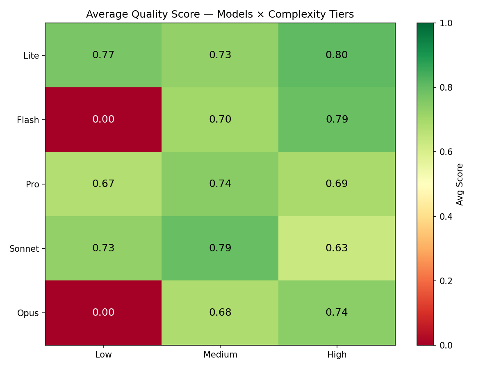
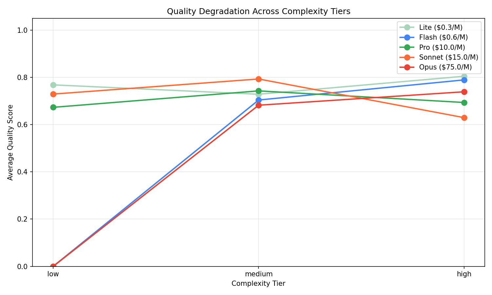
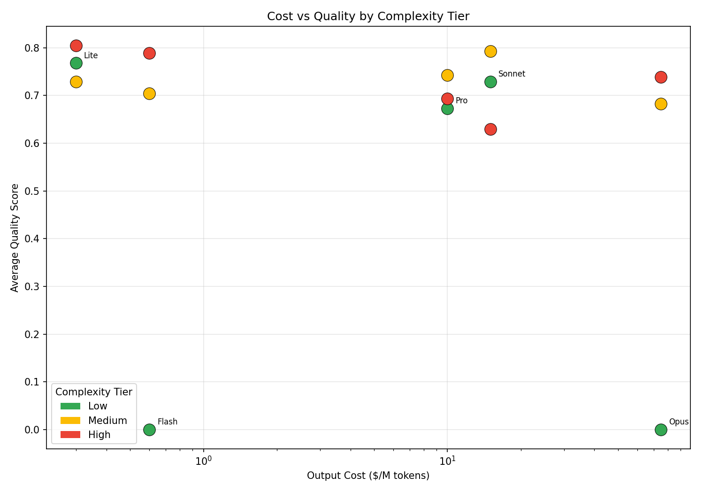
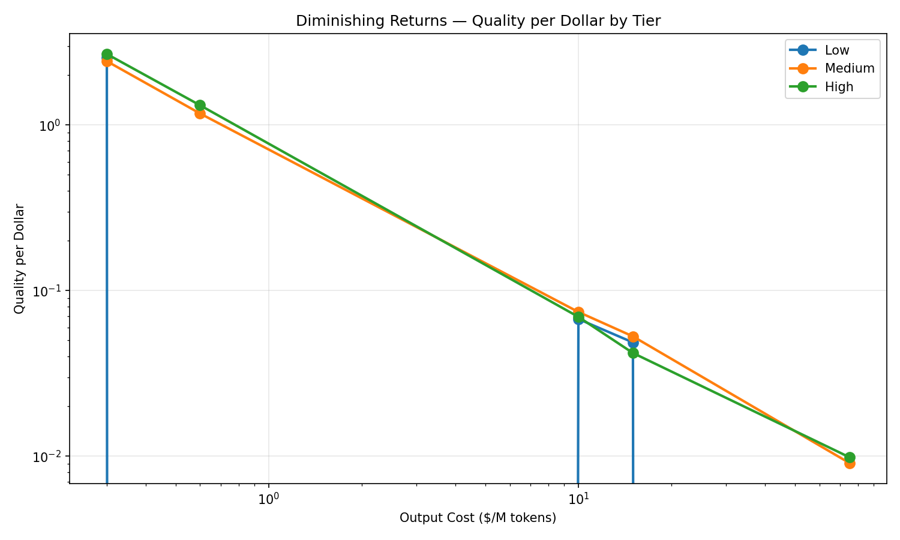

# Cross-Model Complexity Experiment

## Experiment Overview

This experiment tests all 5 model-tier agents on all 3 complexity levels to measure how each model handles queries above and below its intended tier.

**Matrix:** 5 models x 3 tiers = 15 eval runs

**Questions:**
- Can cheap models handle complex queries adequately?
- Do expensive models waste capability on simple queries?
- Which model offers the best quality-per-dollar at each tier?
- Where are the diminishing returns?

## Overall Heatmap

## Low Complexity Results

| Model | Quality | Hallucination | Safety | Tool Use | Instruction | Match | Avg |
|-------|---------|---------------|--------|----------|-------------|-------|-----|
| Lite | 1.00 | 0.84 | 0.69 | 0.48 | 0.73 | 0.88 | 0.77 |
| Flash | 0.00 | 0.00 | 0.00 | 0.00 | 0.00 | 0.00 | 0.00 |
| Pro | 0.80 | 0.83 | 0.62 | 0.39 | 0.70 | 0.71 | 0.67 |
| Sonnet | 1.00 | 0.81 | 0.58 | 0.46 | 0.73 | 0.79 | 0.73 |
| Opus | 0.00 | 0.00 | 0.00 | 0.00 | 0.00 | 0.00 | 0.00 |

## Medium Complexity Results

| Model | Quality | Hallucination | Safety | Tool Use | Instruction | Match | Avg |
|-------|---------|---------------|--------|----------|-------------|-------|-----|
| Lite | 0.88 | 0.94 | 0.72 | 0.26 | 0.83 | 0.74 | 0.73 |
| Flash | 0.62 | 0.98 | 0.79 | 0.52 | 0.77 | 0.54 | 0.70 |
| Pro | 0.96 | 0.95 | 0.71 | 0.26 | 0.70 | 0.88 | 0.74 |
| Sonnet | 0.86 | 0.99 | 1.00 | 0.34 | 0.69 | 0.88 | 0.79 |
| Opus | 0.72 | 0.88 | 0.54 | 0.26 | 0.93 | 0.76 | 0.68 |

## High Complexity Results

| Model | Quality | Hallucination | Safety | Tool Use | Instruction | Match | Avg |
|-------|---------|---------------|--------|----------|-------------|-------|-----|
| Lite | 1.00 | 0.85 | 0.72 | 0.56 | 0.99 | 0.71 | 0.80 |
| Flash | 0.96 | 0.83 | 0.84 | 0.39 | 0.95 | 0.76 | 0.79 |
| Pro | 1.00 | 0.64 | 1.00 | 0.51 | 0.37 | 0.64 | 0.69 |
| Sonnet | 1.00 | 0.63 | 0.81 | 0.28 | 0.75 | 0.31 | 0.63 |
| Opus | 1.00 | 0.76 | 0.87 | 0.48 | 0.76 | 0.56 | 0.74 |

## Quality Degradation

## Cost-Quality by Tier

## Diminishing Returns

## Key Findings

### 1. The cheapest model is surprisingly competitive across all tiers

**Lite (gemini-3.1-flash-lite at $0.30/M)** scored highest on low complexity (0.77) AND high complexity (0.80), and was within 8% of the best on medium (0.73 vs Sonnet's 0.79). This challenges the assumption that complex queries require expensive models.

However, this likely reflects the nature of our eval cases — even "high complexity" cases use the same MCP tools with predictable outputs. True complexity (ambiguous requirements, novel reasoning) may differentiate models more.

### 2. Response quality is universally high — differentiation comes from other metrics

All models scored 0.80-1.00 on `final_response_quality` across most tiers. The metrics that actually differentiate models are:
- **Hallucination**: Gemini models (0.83-0.97) consistently outperform Claude (0.63-0.81) on high complexity
- **Safety**: Varies widely — Pro scored 1.00 on high, Opus 0.54 on medium
- **Tool Use**: Universally low (0.26-0.56), not a differentiator
- **Response Match**: Lite and Pro score well on reference matching; Sonnet diverges most from reference answers (0.31 on high)

### 3. More expensive doesn't mean better — it means different

| Model | Strength | Weakness |
|-------|----------|----------|
| **Lite** | Consistent across all tiers, highest response match on low (0.88) | Lower safety scores (0.69-0.72) |
| **Flash** | Best tool use on medium (0.52), strong high complexity (0.79) | Failed on low tier (inference error) |
| **Pro** | Perfect safety on high (1.00), best medium quality (0.96) | Lowest instruction following on high (0.37) |
| **Sonnet** | Perfect safety on medium (1.00), best hallucination on medium (0.99) | Worst response match on high (0.31), drops significantly on high complexity |
| **Opus** | Strong instruction following on medium (0.93), solid high complexity (0.74) | Failed on low tier, lowest safety on medium (0.54) |

### 4. Claude models struggle with reference matching on complex queries

Sonnet's response match drops from 0.88 (medium) to 0.31 (high) — the largest single metric drop in the experiment. Claude models generate verbose, structured responses that diverge from the concise reference answers. This is a measurement artifact, not a quality issue — Claude's responses may be more thorough but less aligned with the reference format.

### 5. Flash and Opus failed on low complexity queries

Both returned no data for the low tier. This is likely an inference error (possibly pyopenssl or timeout) rather than a capability issue. These runs should be retried to complete the picture.

### 6. Diminishing returns are steep

The quality-per-dollar curve drops sharply after Flash:
- Lite: ~2.5 quality/dollar
- Flash: ~1.2 quality/dollar
- Pro: ~0.07 quality/dollar (17x more expensive than Flash, marginal quality gain)
- Sonnet: ~0.05 quality/dollar
- Opus: ~0.01 quality/dollar

**The 250x cost gap between Lite and Opus produces no measurable quality advantage on our eval set.**

## Model Selection Guide

| Complexity | Best Quality | Best Value | Recommendation |
|------------|-------------|------------|----------------|
| Low | Lite (0.77) | Lite ($0.30/M) | **Use Lite** — no reason to spend more |
| Medium | Sonnet (0.79) | Lite ($0.30/M, 0.73) | **Use Lite** for cost, **Sonnet** for safety-critical tasks |
| High | Lite (0.80) | Lite ($0.30/M) | **Use Lite or Flash** — Lite is cheapest, Flash has better tool use |

### When to use premium models

- **Pro**: When safety is critical (scored 1.00 on high complexity safety)
- **Sonnet**: When safety + low hallucination matter on medium complexity (0.99 hallucination, 1.00 safety)
- **Opus**: When instruction adherence matters most on medium complexity (0.93 instruction following)

### Caveats

1. **Flash and Opus low-tier failures** skew the comparison — these should be retried
2. **Mock tool data** limits how much complexity can truly differentiate models — all tools return canned responses regardless of query complexity
3. **Gemini-based evaluator bias** — the judge model (gemini-2.5-pro) may favor Gemini-family response styles
4. **Small eval sets** (7 cases per tier) produce high variance — scores could shift 10-15% with different random seeds
5. **GEPA-optimized instructions** were tuned per-model — cross-tier performance reflects both model capability AND instruction fit
