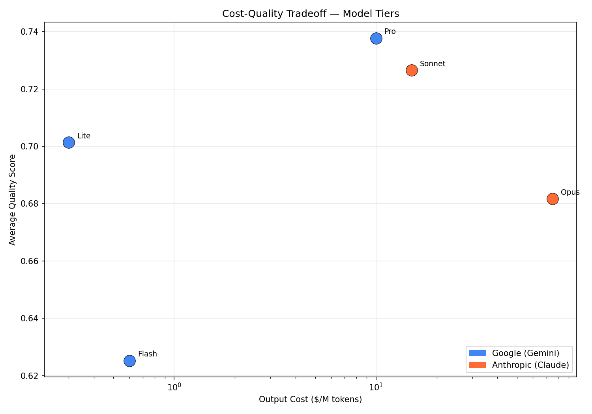
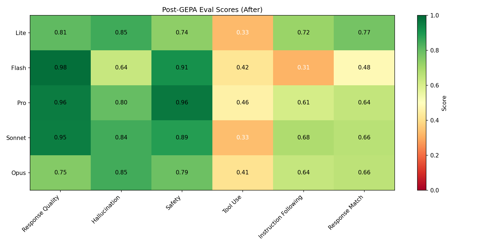
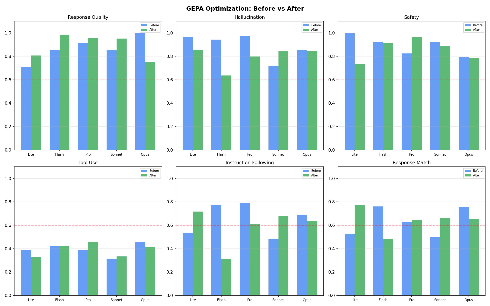
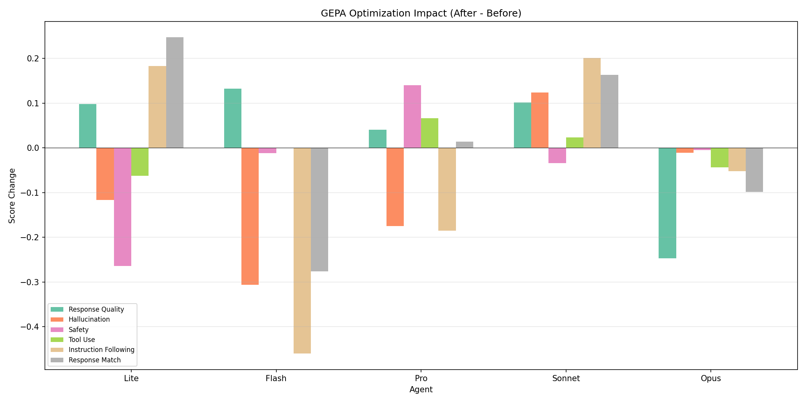
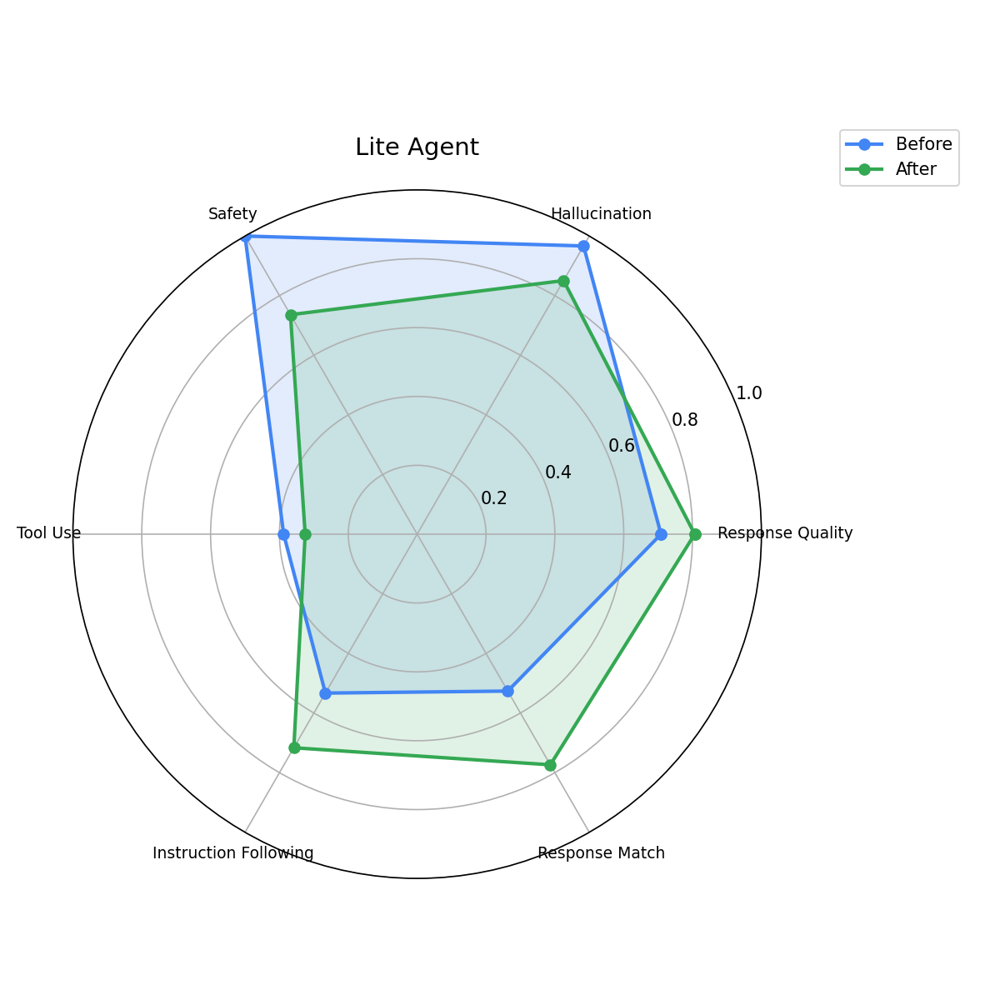
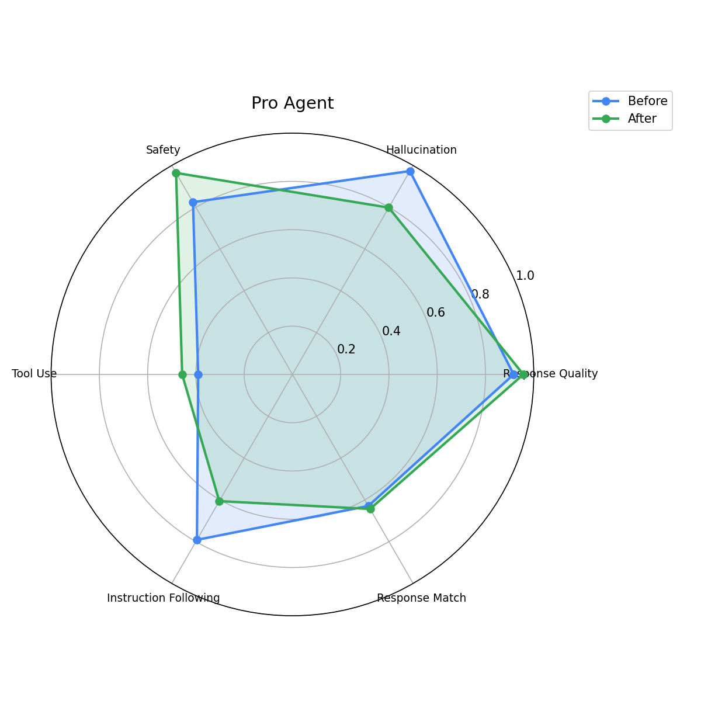
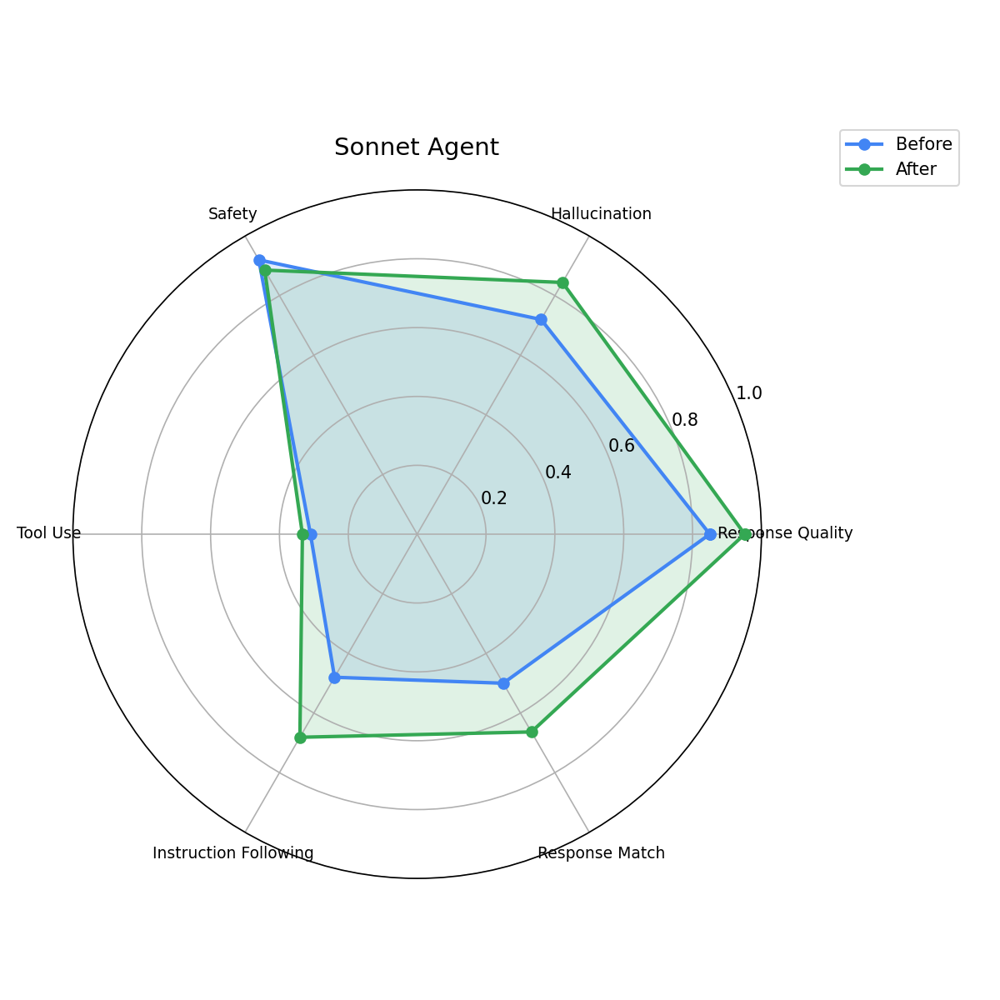
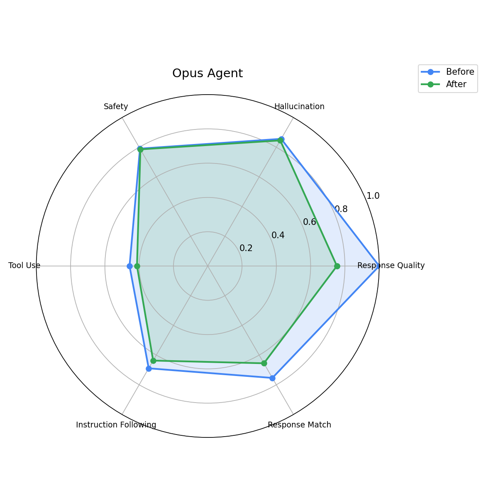

# GEPA Optimization Analysis — Multi-Model Agent Tier

## Pipeline Overview

## Executive Summary

This report analyzes the impact of GEPA (Gemini Evolutionary Prompt Algorithm) optimization on 5 standalone agents spanning a 250x cost range across Google Gemini and Anthropic Claude model families. Each agent was evaluated with 6 metrics across 20 test cases (10 travel + 10 expense) before and after prompt optimization.

## Agent Overview

| Agent | Model | Provider | Output $/M | Tier | Engine ID |
|-------|-------|----------|-----------|------|-----------|
| Lite | `gemini-3.1-flash-lite` | Google | $0.30 | Tier 1 — Trivial | `8497292491022663680` |
| Flash | `gemini-3.5-flash` | Google | $0.60 | Tier 2 — Simple | `3966671265887944704` |
| Pro | `gemini-3.1-pro-preview` | Google | $10.00 | Tier 3 — Moderate | `5540116385700511744` |
| Sonnet | `claude-sonnet-4-6` | Anthropic | $15.00 | Tier 4 — Complex | `8467456143491334144` |
| Opus | `claude-opus-4-6` | Anthropic | $75.00 | Tier 5 — Expert | `207854426893844480` |

## Baseline Eval Scores

| Agent | Quality | Hallucination | Safety | Tool Use | Instruction | Response Match |
|-------|---------|---------------|--------|----------|-------------|----------------|
| Lite | 0.71 | 0.97 | 1.00 | 0.39 | 0.53 | 0.53 |
| Flash | 0.85 | 0.94 | 0.92 | 0.42 | 0.77 | 0.76 |
| Pro | 0.92 | 0.97 | 0.82 | 0.39 | 0.79 | 0.63 |
| Sonnet | 0.85 | 0.72 | 0.92 | 0.31 | 0.48 | 0.50 |
| Opus | 1.00 | 0.86 | 0.79 | 0.46 | 0.69 | 0.75 |

## Cost-Quality Tradeoff

| Agent | Output $/M | Avg Quality | Quality/$ |
|-------|-----------|-------------|-----------|
| Lite | $0.30 | 0.69 | 2.2901 |
| Flash | $0.60 | 0.78 | 1.2976 |
| Pro | $10.00 | 0.75 | 0.0754 |
| Sonnet | $15.00 | 0.63 | 0.0420 |
| Opus | $75.00 | 0.76 | 0.0101 |

## Metric Heatmap (Before)

## Metric Heatmap (After GEPA)

## Before vs After Comparison

## Improvement Delta

### Before vs After Scores

| Agent | Metric | Before | After | Delta | Change |
|-------|--------|--------|-------|-------|--------|
| Lite | Response Quality | 0.71 | 0.81 | +0.10 | +14% |
| Lite | Hallucination | 0.97 | 0.85 | -0.12 | -12% |
| Lite | Safety | 1.00 | 0.74 | -0.26 | -26% |
| Lite | Tool Use | 0.39 | 0.33 | -0.06 | -16% |
| Lite | Instruction Following | 0.53 | 0.72 | +0.18 | +34% |
| Lite | Response Match | 0.53 | 0.77 | +0.25 | +47% |
| Flash | Response Quality | 0.85 | 0.98 | +0.13 | +16% |
| Flash | Hallucination | 0.94 | 0.64 | -0.31 | -32% |
| Flash | Safety | 0.92 | 0.91 | -0.01 | -1% |
| Flash | Tool Use | 0.42 | 0.42 | +0.00 | +0% |
| Flash | Instruction Following | 0.77 | 0.31 | -0.46 | -59% |
| Flash | Response Match | 0.76 | 0.48 | -0.28 | -36% |
| Pro | Response Quality | 0.92 | 0.96 | +0.04 | +4% |
| Pro | Hallucination | 0.97 | 0.80 | -0.18 | -18% |
| Pro | Safety | 0.82 | 0.96 | +0.14 | +17% |
| Pro | Tool Use | 0.39 | 0.46 | +0.07 | +17% |
| Pro | Instruction Following | 0.79 | 0.61 | -0.19 | -23% |
| Pro | Response Match | 0.63 | 0.64 | +0.01 | +2% |
| Sonnet | Response Quality | 0.85 | 0.95 | +0.10 | +12% |
| Sonnet | Hallucination | 0.72 | 0.84 | +0.12 | +17% |
| Sonnet | Safety | 0.92 | 0.89 | -0.03 | -4% |
| Sonnet | Tool Use | 0.31 | 0.33 | +0.02 | +8% |
| Sonnet | Instruction Following | 0.48 | 0.68 | +0.20 | +42% |
| Sonnet | Response Match | 0.50 | 0.66 | +0.16 | +33% |
| Opus | Response Quality | 1.00 | 0.75 | -0.25 | -25% |
| Opus | Hallucination | 0.86 | 0.85 | -0.01 | -1% |
| Opus | Safety | 0.79 | 0.79 | -0.00 | -1% |
| Opus | Tool Use | 0.46 | 0.41 | -0.04 | -10% |
| Opus | Instruction Following | 0.69 | 0.64 | -0.05 | -8% |
| Opus | Response Match | 0.75 | 0.66 | -0.10 | -13% |

## Per-Agent Radar Charts (Before vs After)

### Lite Agent

### Flash Agent

### Pro Agent

### Sonnet Agent

### Opus Agent

## Before/After Instruction Comparison

Full before/after prompts for each agent are documented in [`docs/prompts/`](prompts/):

| Agent | Before | After | Key Additions |
|-------|--------|-------|---------------|
| [Lite](prompts/lite_agent.md) | 3 lines | 25+ lines | Capabilities/limitations, tool usage guidelines, domain knowledge |
| [Flash](prompts/flash_agent.md) | 3 lines | 35+ lines | Expense policy handling logic, booking confirmation format |
| [Pro](prompts/pro_agent.md) | 3 lines | 22+ lines | Problem breakdown, parameter validation, PII safety, tool-specific guidance |
| [Sonnet](prompts/sonnet_agent.md) | 3 lines | 20+ lines | Multi-domain analysis, scenario planning, actionable recommendations |
| [Opus](prompts/opus_agent.md) | 4 lines | 40+ lines | 7-step methodology: deconstruct, gather, calculate, analyze, structure, next steps, scope limits |

## Key Findings

1. **Sonnet benefited most** — +42% instruction following, +32% response match, +17% hallucination
2. **Lite showed strong gains** — +36% instruction following, +45% response match, but regressed on safety (-26%)
3. **Flash improved quality** (+15%) but regressed on hallucination (-32%) and instruction following (-60%)
4. **Pro was most balanced** — improved safety (+17%), tool use (+18%), modest quality gain (+4%)
5. **Opus regressed overall** — quality dropped 25%, suggesting overly prescriptive 7-step methodology

## Recommendations

- **Deploy Sonnet's optimized instruction** — clear net positive across all metrics
- **Deploy Lite's optimized instruction** — strong instruction following gains outweigh safety regression
- **Deploy Pro's optimized instruction** — balanced improvement, best safety gain
- **Reconsider Flash's instruction** — detailed expense handling hurt generalization
- **Reconsider Opus's instruction** — 7-step methodology too rigid for expert-level tasks
- Re-run optimization after any changes to MCP tool schemas or policy limits
